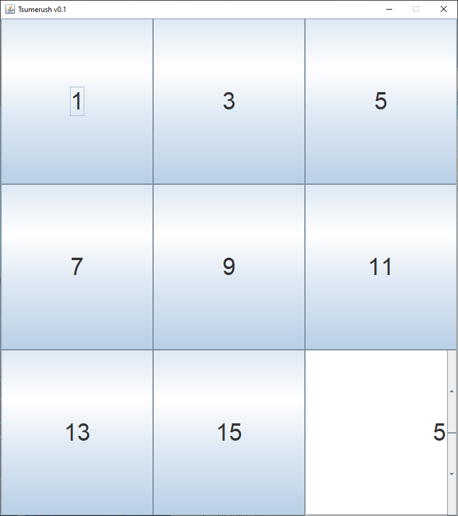
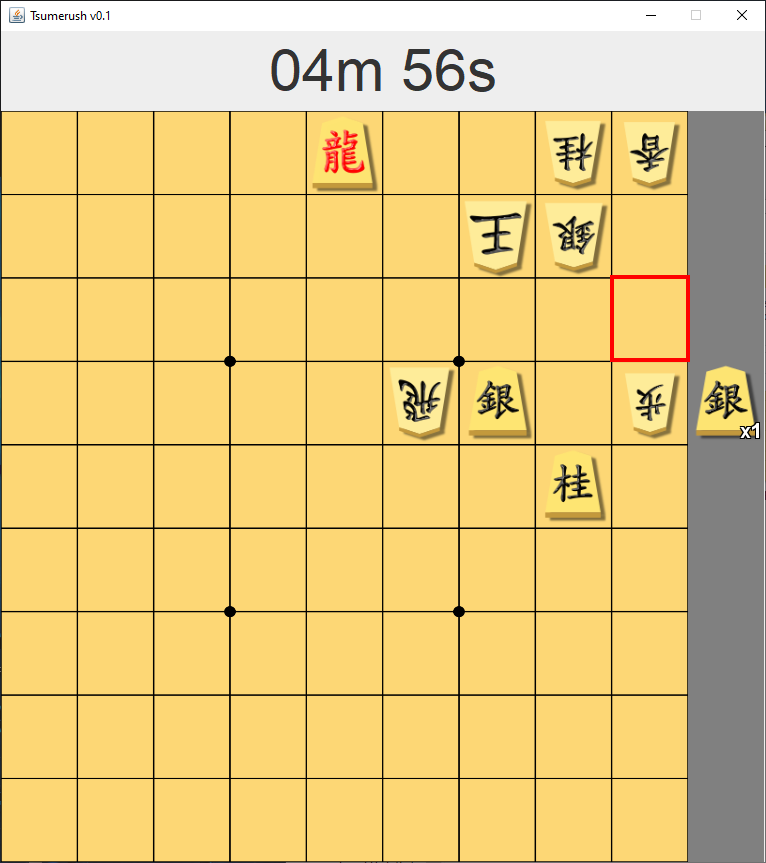

A simple Shogi tsumerush app.

[Download](https://github.com/Kuukyo3/tsumerush/raw/master/tsumerush.jar)

You can choose between 1, 3, 5, 7, 9, 11, 13 and 15 move tsume (Shogi mating puzzles).
At the bottom right corner you can choose the duration in minutes you want to play for.

Clicking on pieces picks them up, right click puts the piece down again.
Clicking anywhere will count as a move (there is no rule validation, even clicking on the origin square will count as input).

The tsume solutions are pre-computed, but only consist of one line. Meaning a solution might be correct but the app will still count it as wrong.
A good rule of thumb is to use a previously moved piece for mate.
